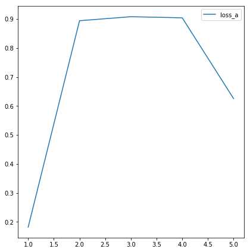
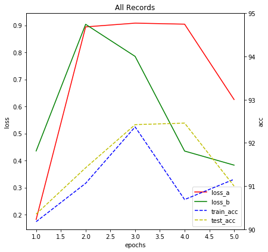

# RecordManager

<!-- MarkdownTOC autolink="true" lowercase="false" -->

- [Init RecordManager](#Init-RecordManager)
- [Use RecordManager](#Use-RecordManager)
- [Plot](#Plot)

<!-- /MarkdownTOC -->


```python
import random
from torchhk.rm import RecordManager
```

## Init RecordManager


```python
rm = RecordManager(['Epoch', 'Iter', 'loss_a', 'loss_b', 'train_acc', 'test_acc'])
rm
```


    RecordManager(keys=[Epoch, Iter, loss_a, loss_b, train_acc, test_acc])


## Use RecordManager


```python
for epoch in range(5):
    
    for i in range(2) :

        #########
        # Train #
        #########
        
        rm.progress()
        
        rm.add([epoch+1, i,
                random.random(), random.random(),
                90+random.random()*(epoch+1), 90+random.random()*(epoch+1)])

rm.summary()
```

    --------------------------------------------------------
    Epoch   Iter   loss_a   loss_b   train_acc   test_acc   
    ========================================================
    1       0      0.5122   0.8280   90.1486     90.2941    
    --------------------------------------------------------
    1       1      0.1822   0.4356   90.1765     90.3528    
    --------------------------------------------------------
    2       0      0.6448   0.4194   91.9486     90.3231    
    --------------------------------------------------------
    2       1      0.8943   0.9038   91.0642     91.4241    
    --------------------------------------------------------
    3       0      0.6358   0.7359   92.4341     90.5188    
    --------------------------------------------------------
    3       1      0.9082   0.7852   92.3704     92.4229    
    --------------------------------------------------------
    4       0      0.9486   0.1586   93.7000     91.9010    
    --------------------------------------------------------
    4       1      0.9043   0.4352   90.6886     92.4582    
    --------------------------------------------------------
    5       0      0.1235   0.1660   91.9936     91.1863    
    --------------------------------------------------------
    5       1      0.6256   0.3831   91.1582     91.0011    
    --------------------------------------------------------
    ========================================================
    Total Epoch: 5
    Time Elapsed: 0:00:00.046384
    Min(epoch)/Max(epoch): 
    -loss_a: 0.1235(5)/0.9486(4)
    -loss_b: 0.1586(4)/0.9038(2)
    -train_acc: 90.1486(1)/93.7000(4)
    -test_acc: 90.2941(1)/92.4582(4)
    --------------------------------------------------------
    

## Plot


```python
rm.plot('Epoch', 'loss_a')
```





```python
rm.plot('Epoch', [['loss_a', 'loss_b'], ['train_acc', 'test_acc']], 
        title="All Records", xlabel='epochs', ylabel="loss", ylabel_second="acc",
        ylim_second=(90,95),
        linestyles=['-', '-', '--', '--'],
        colors=['r', 'g', 'b', 'y'])
```




