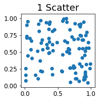
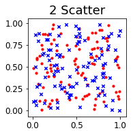
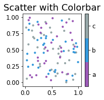
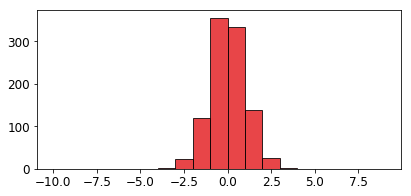
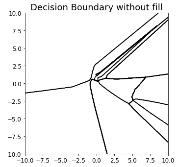

# Vis


```python
from torchhk.vis import *
```


```python
import matplotlib.pyplot as plt
import matplotlib
matplotlib.rcParams.update({'font.size': 15})
plt.rc('xtick', labelsize=12)    # fontsize of the tick labels
plt.rc('ytick', labelsize=12)    # fontsize of the tick labels
```

## Base

### Create Plot


```python
ax = init_plot(ax=None, figsize=(3,3), title="", xlabel="", ylabel="",
               xlim=None, ylim=None, pad_ratio=0, show_axis=True, tight=True)
```


### Subplots


```python
fig, ax = plt.subplots(1, 3, figsize=(9,3))
ax1 = init_plot(ax=ax[0], title="Figure 1")
ax2 = init_plot(ax=ax[1], title="Figure 2")
ax3 = init_plot(ax=ax[2], title="Figure 3")
```


### Twinplot


```python
ax1 = init_plot(title="Figure 1", ylabel="First")
ax2 = make_twin(ax1, ylabel="Second")
```


### Cmap


```python
cmap = get_cmap(input='tab10', num=10)
sns.palplot(cmap.colors)
```


```python
cmap = get_cmap(input='viridis', num=5)
sns.palplot(cmap.colors)
```


```python
cmap = get_cmap(input=["#9b59b6", "#3498db", "#95a5a6"], num=3)
sns.palplot(cmap.colors)
```


## Feature

### plot_scatter


```python
ax = init_plot(figsize=(3,3), title="1 Scatter")
plot_scatter(ax, torch.rand(100, 2))
```





```python
ax = init_plot(figsize=(3,3), title="2 Scatter")
plot_scatter(ax, torch.rand(100, 2), color='red', marker='o', marker_size=10)
plot_scatter(ax, torch.rand(100, 2), color='blue', marker='x', marker_size=20)
```





```python
ax = init_plot(figsize=(3,3), title="Scatter with Colorbar")
plot_scatter(ax, torch.rand(100, 2), color=torch.randint(low=0, high=3, size=torch.rand(100).shape),
             marker='o', marker_size=10, cmap=cmap, colorbar=True, colorbar_ticks=['a', 'b', 'c'])
```





### plot_line


```python
ax = init_plot(figsize=(6, 3), show_grid=True)
x = np.array([2, 3, 4, 5, 6, 7, 8, 9])
y = np.array([86.8, 87.7, 87.8, 88.0, 88.0, 88.0, 88.3, 88.3])

plot_line(ax, x, y, marker='o', markerfacecolor="#e3171a", markersize=6, 
          color="#e3171a", linewidth=2, label="A")
ax.legend(loc="upper left")
```


    <matplotlib.legend.Legend at 0x1ad2f8e76d8>


```python
ax = init_plot(figsize=(6, 3), show_grid=True)
ax2 = make_twin(ax=ax)

x = np.array([2, 3, 4, 5, 6, 7, 8, 9])
y1 = np.array([86.8, 87.7, 87.8, 88.0, 88.0, 88.0, 88.3, 88.3])
y2 = np.array([32.5, 33.9, 33.7, 33.3, 32.7, 32.6, 33.3, 33.0])

plot_line(ax, x, y, marker='o', markerfacecolor="#367eb8", markersize=6, 
          color="#367eb8", linewidth=2, label="A")
plot_line(ax2, x, y2, marker='o', markerfacecolor="#e3171a", markersize=6, 
          color="#e3171a", linewidth=2, label="B")
plt.axvline(x=5, color='k', linestyle='--', alpha=0.8)

lines, labels = ax.get_legend_handles_labels()
lines2, labels2 = ax2.get_legend_handles_labels()
ax2.legend(lines + lines2, labels + labels2, loc='upper left')

# plt.tight_layout()
# plt.savefig("./Imgs.pdf")
```


    <matplotlib.legend.Legend at 0x1ad30954f98>


### plot_dist


```python
ax = init_plot(figsize=(6, 3))

x = np.random.normal(0, 1, 1000)

plot_hist(ax, x, color="#e3171a", label="A", alpha=0.8,
          bins=np.arange(-10, 10, 1), edgecolor="#000000")
```





### plot_hist


```python
ax = init_plot(figsize=(3,3), title="2 Scatter")
plot_dist(ax, torch.rand(100), bins=[0, 0.2, 0.4, 0.6, 0.8, 1], stat=True, norm_hist=False)
```

    - Stats
    Max : 0.980573
    Min : 0.001386
    Mean : 0.502454
    Median : 0.482120


### plot_img


```python
from torchhk.datasets import *
```


```python
data =Datasets(data_name="CIFAR10")
train_loader, test_loader = data.get_loader(batch_size=12)
train_images, _ = iter(train_loader).next()
```

    Files already downloaded and verified
    Files already downloaded and verified
    Data Loaded!
    Train Data Length : 50000
    Test Data Length : 10000


```python
ax = init_plot(figsize=(5, 5), title="Tensor Images")
plot_img(ax, train_images, ncols=3, padding=3, pad_value=0.5)
```


### plot_pca


```python
ax = init_plot(figsize=(5, 5), title="PCA")
plot_pca(ax, [torch.rand(100, 3), torch.rand(100, 3)], colors=['blue', 'red'])
```


### plot_tsne


```python
ax = init_plot(figsize=(5, 5), title="TSNE")
plot_pca(ax, [torch.rand(100, 3), torch.rand(100, 3)], colors=['blue', 'red'], alphas=[0.2, 0.5])
```


## Model


```python
import torch
import torch.nn as nn
import torch.optim as optim
import torch.nn.init as init
```


```python
class CNN(nn.Module):
    def __init__(self):
        super(CNN, self).__init__()
        
        self.conv_layer = nn.Sequential(
            nn.Conv2d(1,32,5),
            nn.MaxPool2d(2,2),
            nn.ReLU(),
            nn.Conv2d(32,64,5),
            nn.MaxPool2d(2,2),
            nn.ReLU(),
            nn.Flatten()
        )
        
        self.fc_layer = nn.Sequential(
            nn.Linear(64*4*4, 100),
            nn.ReLU(),
            nn.Linear(100, 2),
            nn.ReLU(),
            nn.Linear(2, 100),
            nn.ReLU(),
            nn.Linear(100, 10)
        )       
        
    def forward(self,x):
        out = self.conv_layer(x)
        out = self.fc_layer(out)

        return out
```


```python
model = CNN().cuda()
```


```python
loss = nn.CrossEntropyLoss()
optimizer = optim.SGD(model.parameters(), lr=0.1,
                      momentum=0.9, weight_decay=5e-4)
num_epochs = 2
```


```python
data = Datasets(data_name="MNIST")
train_loader, test_loader = data.get_loader(batch_size=128)
```

    Data Loaded!
    Train Data Length : 60000
    Test Data Length : 10000


```python
for epoch in range(num_epochs):
    
    for i, (batch_images, batch_labels) in enumerate(train_loader):
        
        X = batch_images.cuda()
        Y = batch_labels.cuda()

        pre = model(X)
        cost = loss(pre, Y)

        optimizer.zero_grad()
        cost.backward()
        optimizer.step()

        if (i+1) % 200 == 0:
            print('Epoch [%d/%d], lter [%d/%d], Loss: %.4f'
                 %(epoch+1, num_epochs, i+1, len(train_loader), cost.item()))
```

    Epoch [1/2], lter [200/468], Loss: 0.3718
    Epoch [1/2], lter [400/468], Loss: 0.5179
    Epoch [2/2], lter [200/468], Loss: 0.9221
    Epoch [2/2], lter [400/468], Loss: 0.7831


```python
correct = 0
total = 0

for images, labels in test_loader:
    
    images = images.cuda()
    outputs = model(images)
    
    _, predicted = torch.max(outputs.data, 1)
    
    total += labels.size(0)
    correct += (predicted == labels.cuda()).sum()
    
print('Accuracy of test images: %f %%' % (100 * float(correct) / total))
```

    Accuracy of test images: 61.150000 %


### plot_logit_dist


```python
ax = init_plot(figsize=(5, 5), title="Logit DIstributions")
plot_logit_dist(ax, model, train_loader)
```

    - Stats
    Max : 43.055912
    Min : -34.867428
    Mean : 0.002791
    Median : -0.191598


    C:\Users\slcf\Anaconda3\lib\site-packages\scipy\stats\stats.py:1713: FutureWarning:
    
    Using a non-tuple sequence for multidimensional indexing is deprecated; use `arr[tuple(seq)]` instead of `arr[seq]`. In the future this will be interpreted as an array index, `arr[np.array(seq)]`, which will result either in an error or a different result.


​    


### plot_grad_dist


```python
ax = init_plot(figsize=(5, 5), title=r"Gradient Distributions ($\nabla_x L$)")
plot_grad_dist(ax, model, train_loader, loss=nn.CrossEntropyLoss(), bins=[-0.1, -0.05, 0, 0.05, 0.1])
```

    - Stats
    Max : 0.511684
    Min : -0.437487
    Mean : -0.000006
    Median : 0.000000


### plot_decision_boundary


```python
class latent() :
    def __init__(self, model) :
        self.model = model
        
    def parameters(self) :
        return self.model.fc_layer[4:].parameters()
    
    def __call__(self, x) :
        out = self.model.fc_layer[4:](x)
        _, predicted = torch.max(out, 1)
        return predicted
        
latent_model = latent(model)
```


```python
ax = init_plot(figsize=(5, 5), title="Decision Boundary")
plot_decision_boundary(ax, latent_model, xrange=(-10, 10), yrange=(-10, 10))
```


```python
cmap = get_cmap('tab10', 10)

ax = init_plot(figsize=(5, 5), title="Decision Boundary with Colorbar")
plot_decision_boundary(ax, latent_model, xrange=(-10, 10), yrange=(-10, 10),
                       cmap=cmap, colorbar=True)#, colorbar_ticks=['0', '1', '2', '3', '4', '5', '6', '7', '8', '9'])
```


```python
cmap = get_cmap(['#000000']*10)
ax = init_plot(figsize=(5, 5), title="Decision Boundary without fill")
plot_decision_boundary(ax, latent_model, xrange=(-10, 10), yrange=(-10, 10), as_line=True, cmap=cmap)
```





### plot_weight


```python
def filter(name) :
    isWeight = "weight" in name
    return isWeight
```


```python
ax = init_plot(figsize=(5, 5), title="Weight")
plot_weight(ax, model, filter=filter)
```

    - Stats
    Max : 2.941182
    Min : -5.076963
    Mean : -0.018857
    Median : -0.008295


    C:\Users\slcf\Anaconda3\lib\site-packages\scipy\stats\stats.py:1713: FutureWarning:
    
    Using a non-tuple sequence for multidimensional indexing is deprecated; use `arr[tuple(seq)]` instead of `arr[seq]`. In the future this will be interpreted as an array index, `arr[np.array(seq)]`, which will result either in an error or a different result.


​    


### plot_individual_weight


```python
def filter(name) :
    isWeight = "weight" in name
    isConv = "conv" in name
    return isWeight*isConv
```


```python
plot_individual_weight(model, ncols=1, filter=filter)
```

    C:\Users\slcf\Anaconda3\lib\site-packages\scipy\stats\stats.py:1713: FutureWarning:
    
    Using a non-tuple sequence for multidimensional indexing is deprecated; use `arr[tuple(seq)]` instead of `arr[seq]`. In the future this will be interpreted as an array index, `arr[np.array(seq)]`, which will result either in an error or a different result.


​    


### plot_perturb


```python
images, labels = iter(test_loader).next()
```


```python
j=1
a = 4*torch.rand_like(images[0])
b = 4*torch.rand_like(images[0])

rx, ry, zs, colors = cal_perturb(model=model,
                                 image=images[j], label=labels[j],
                                 vec_x=b, vec_y=a,
                                 range_x=(0,1), range_y=(0,1), 
                                 grid_size=30,
                                 loss=nn.CrossEntropyLoss(reduction='none'),
                                )
```


```python
plot_perturb_plotly(rx, ry, zs, colors,
                    z_by_loss=True, color_by_loss=False, 
                    title='Loss Visualization', width=600, height=600,
                    x_ratio=1, y_ratio=1, z_ratio=0.8,
                   )
```


<div>

​        
            <div id="f66eb5e1-37da-40f2-a3ed-9a85d2badddb" class="plotly-graph-div" style="height:600px; width:600px;"></div>
            <script type="text/javascript">
                require(["plotly"], function(Plotly) {
                    window.PLOTLYENV=window.PLOTLYENV || {};
                    
                if (document.getElementById("f66eb5e1-37da-40f2-a3ed-9a85d2badddb")) {
                    Plotly.newPlot(
                        'f66eb5e1-37da-40f2-a3ed-9a85d2badddb',
                        [{"cmax": 9, "cmin": 2, "colorscale": [[0.0, "#440154"], [0.1111111111111111, "#482878"], [0.2222222222222222, "#3e4989"], [0.3333333333333333, "#31688e"], [0.4444444444444444, "#26828e"], [0.5555555555555556, "#1f9e89"], [0.6666666666666666, "#35b779"], [0.7777777777777778, "#6ece58"], [0.8888888888888888, "#b5de2b"], [1.0, "#fde725"]], "showscale": true, "surfacecolor": [[2, 2, 2, 2, 2, 2, 2, 2, 2, 2, 2, 2, 2, 2, 2, 2, 2, 8, 8, 8, 8, 8, 8, 8, 8, 8, 8, 8, 8, 8], [2, 2, 2, 2, 2, 2, 2, 2, 2, 2, 2, 2, 2, 2, 2, 2, 2, 2, 2, 8, 8, 8, 8, 8, 8, 8, 8, 8, 8, 8], [2, 2, 2, 2, 2, 2, 2, 2, 2, 2, 2, 2, 2, 2, 2, 2, 2, 2, 2, 2, 8, 8, 8, 8, 8, 8, 8, 8, 8, 8], [2, 2, 2, 2, 2, 2, 2, 2, 2, 2, 2, 2, 2, 2, 2, 2, 2, 2, 2, 2, 2, 2, 8, 8, 8, 8, 8, 8, 8, 8], [2, 2, 2, 2, 2, 2, 2, 2, 2, 2, 2, 2, 2, 2, 2, 2, 2, 2, 2, 2, 2, 2, 2, 8, 8, 8, 8, 8, 8, 8], [2, 2, 2, 2, 2, 2, 2, 2, 2, 2, 2, 2, 2, 2, 2, 2, 2, 2, 2, 2, 2, 2, 2, 8, 8, 8, 8, 8, 8, 8], [2, 2, 2, 2, 2, 2, 2, 2, 2, 2, 2, 2, 2, 2, 2, 2, 2, 2, 2, 2, 2, 2, 8, 8, 8, 8, 8, 8, 8, 8], [2, 2, 2, 2, 2, 2, 2, 2, 2, 2, 2, 2, 2, 2, 2, 2, 2, 2, 2, 2, 2, 2, 8, 8, 8, 8, 8, 8, 8, 8], [2, 2, 2, 2, 2, 2, 2, 2, 2, 2, 2, 2, 2, 2, 2, 2, 2, 2, 2, 2, 2, 2, 8, 8, 8, 8, 8, 8, 3, 3], [2, 2, 2, 2, 2, 2, 2, 2, 2, 2, 2, 2, 2, 2, 2, 2, 2, 2, 2, 2, 2, 2, 8, 8, 8, 8, 8, 8, 3, 5], [2, 2, 2, 2, 2, 2, 2, 2, 2, 2, 2, 2, 2, 2, 2, 2, 2, 2, 2, 2, 2, 8, 8, 8, 8, 8, 8, 8, 3, 5], [2, 2, 2, 2, 2, 2, 2, 2, 2, 2, 2, 2, 2, 2, 2, 2, 2, 2, 2, 2, 2, 8, 8, 8, 8, 8, 8, 3, 5, 9], [2, 2, 2, 2, 2, 2, 2, 2, 2, 2, 2, 2, 2, 2, 2, 2, 2, 2, 2, 2, 2, 8, 8, 8, 8, 8, 8, 3, 5, 9], [2, 2, 2, 2, 2, 2, 2, 2, 2, 2, 2, 2, 2, 2, 2, 2, 2, 2, 2, 2, 8, 8, 8, 8, 8, 8, 3, 5, 9, 9], [2, 2, 2, 2, 2, 2, 2, 2, 2, 2, 2, 2, 2, 2, 2, 2, 2, 2, 2, 2, 8, 8, 8, 8, 8, 3, 3, 9, 9, 9], [2, 2, 2, 2, 2, 2, 2, 2, 2, 2, 2, 2, 2, 2, 2, 2, 2, 2, 2, 8, 8, 8, 8, 8, 3, 3, 5, 9, 9, 9], [2, 2, 2, 2, 2, 2, 2, 2, 2, 2, 2, 2, 2, 2, 2, 2, 2, 2, 8, 8, 8, 8, 8, 3, 3, 5, 9, 9, 9, 9], [2, 2, 2, 2, 2, 2, 2, 2, 2, 2, 2, 2, 2, 2, 2, 2, 2, 8, 8, 8, 8, 8, 3, 3, 5, 9, 9, 9, 9, 9], [2, 2, 2, 2, 2, 2, 2, 2, 2, 2, 2, 2, 2, 2, 8, 8, 8, 8, 8, 8, 8, 3, 3, 5, 9, 9, 9, 9, 9, 9], [2, 2, 2, 2, 2, 2, 2, 2, 2, 2, 2, 2, 2, 8, 8, 8, 8, 8, 8, 8, 3, 3, 3, 9, 9, 9, 9, 9, 9, 9], [2, 2, 2, 2, 2, 2, 2, 2, 2, 2, 2, 2, 2, 8, 8, 8, 8, 8, 3, 3, 3, 3, 5, 9, 9, 9, 9, 9, 9, 9], [2, 2, 2, 2, 2, 2, 2, 2, 2, 2, 2, 2, 2, 2, 8, 8, 8, 3, 3, 3, 3, 3, 5, 9, 9, 9, 9, 9, 9, 9], [2, 2, 2, 2, 2, 2, 2, 2, 2, 2, 2, 2, 2, 2, 8, 8, 8, 3, 3, 3, 3, 5, 9, 9, 9, 9, 9, 9, 9, 9], [2, 2, 2, 2, 2, 2, 2, 2, 2, 2, 2, 2, 2, 2, 8, 8, 8, 3, 3, 3, 3, 5, 9, 9, 9, 9, 9, 9, 9, 9], [2, 2, 2, 2, 2, 2, 2, 2, 2, 2, 2, 2, 2, 2, 2, 8, 8, 3, 3, 3, 3, 9, 9, 9, 9, 9, 9, 9, 9, 9], [2, 2, 2, 2, 2, 2, 2, 2, 2, 2, 2, 2, 2, 2, 2, 8, 8, 3, 3, 3, 5, 9, 9, 9, 9, 9, 9, 9, 9, 9], [2, 2, 2, 2, 2, 2, 2, 2, 2, 2, 2, 2, 2, 2, 2, 8, 8, 3, 3, 3, 9, 9, 9, 9, 9, 9, 9, 9, 9, 9], [2, 2, 2, 2, 2, 2, 2, 2, 2, 2, 2, 2, 2, 2, 2, 8, 8, 3, 3, 5, 9, 9, 9, 9, 9, 9, 9, 9, 9, 9], [2, 2, 2, 2, 2, 2, 2, 2, 2, 2, 2, 2, 2, 2, 2, 2, 8, 8, 3, 5, 9, 9, 9, 9, 9, 9, 9, 9, 9, 9], [2, 2, 2, 2, 2, 2, 2, 2, 2, 2, 2, 2, 2, 2, 2, 2, 8, 8, 3, 5, 9, 9, 9, 9, 9, 9, 9, 9, 9, 9]], "type": "surface", "x": [0.0, 0.034482758620689655, 0.06896551724137931, 0.10344827586206896, 0.13793103448275862, 0.1724137931034483, 0.20689655172413793, 0.24137931034482757, 0.27586206896551724, 0.3103448275862069, 0.3448275862068966, 0.3793103448275862, 0.41379310344827586, 0.4482758620689655, 0.48275862068965514, 0.5172413793103449, 0.5517241379310345, 0.5862068965517241, 0.6206896551724138, 0.6551724137931034, 0.6896551724137931, 0.7241379310344828, 0.7586206896551724, 0.7931034482758621, 0.8275862068965517, 0.8620689655172413, 0.896551724137931, 0.9310344827586207, 0.9655172413793103, 1.0], "y": [0.0, 0.034482758620689655, 0.06896551724137931, 0.10344827586206896, 0.13793103448275862, 0.1724137931034483, 0.20689655172413793, 0.24137931034482757, 0.27586206896551724, 0.3103448275862069, 0.3448275862068966, 0.3793103448275862, 0.41379310344827586, 0.4482758620689655, 0.48275862068965514, 0.5172413793103449, 0.5517241379310345, 0.5862068965517241, 0.6206896551724138, 0.6551724137931034, 0.6896551724137931, 0.7241379310344828, 0.7586206896551724, 0.7931034482758621, 0.8275862068965517, 0.8620689655172413, 0.896551724137931, 0.9310344827586207, 0.9655172413793103, 1.0], "z": [[1.0595707893371582, 1.0581302642822266, 1.0628855228424072, 1.0797090530395508, 1.1033308506011963, 1.1241981983184814, 1.144042730331421, 1.1634819507598877, 1.1979085206985474, 1.2346020936965942, 1.2601854801177979, 1.275585412979126, 1.2958109378814697, 1.3257503509521484, 1.3622643947601318, 1.408779263496399, 1.4600319862365723, 1.5140588283538818, 1.5659972429275513, 1.6111124753952026, 1.6407922506332397, 1.6423910856246948, 1.635119080543518, 1.6283187866210938, 1.6200485229492188, 1.6048632860183716, 1.5848665237426758, 1.5694777965545654, 1.5547003746032715, 1.543212890625], [1.058279037475586, 1.0617785453796387, 1.0734596252441406, 1.0942821502685547, 1.1142373085021973, 1.1328437328338623, 1.1511833667755127, 1.174737811088562, 1.210985779762268, 1.2354910373687744, 1.2478513717651367, 1.2623991966247559, 1.278398036956787, 1.29905366897583, 1.3269894123077393, 1.3587844371795654, 1.4032713174819946, 1.4515641927719116, 1.505812406539917, 1.5508317947387695, 1.5883291959762573, 1.6201777458190918, 1.637453317642212, 1.6388773918151855, 1.634766697883606, 1.6206119060516357, 1.6073895692825317, 1.5953651666641235, 1.5812822580337524, 1.5680996179580688], [1.0599932670593262, 1.0692541599273682, 1.087188720703125, 1.1048009395599365, 1.1184239387512207, 1.135972499847412, 1.1557960510253906, 1.1809630393981934, 1.2112822532653809, 1.2261319160461426, 1.2392977476119995, 1.2518136501312256, 1.2720354795455933, 1.2925410270690918, 1.3143718242645264, 1.3386259078979492, 1.3728924989700317, 1.4103184938430786, 1.451019287109375, 1.4945988655090332, 1.5276803970336914, 1.5558834075927734, 1.5812201499938965, 1.6128458976745605, 1.6279189586639404, 1.6235878467559814, 1.6248500347137451, 1.620012879371643, 1.6038390398025513, 1.5817393064498901], [1.0669479370117188, 1.0822038650512695, 1.0978784561157227, 1.1083157062530518, 1.1245522499084473, 1.142202377319336, 1.1554838418960571, 1.1801081895828247, 1.203900933265686, 1.2201056480407715, 1.2318521738052368, 1.24662184715271, 1.2707582712173462, 1.2872629165649414, 1.3034849166870117, 1.3227474689483643, 1.349452257156372, 1.3850023746490479, 1.4254701137542725, 1.470802664756775, 1.496726393699646, 1.5098695755004883, 1.5238926410675049, 1.5431181192398071, 1.5680383443832397, 1.5917342901229858, 1.597391128540039, 1.5904117822647095, 1.5822930335998535, 1.5725369453430176], [1.0788967609405518, 1.0901761054992676, 1.0983026027679443, 1.1120126247406006, 1.127000331878662, 1.1404986381530762, 1.153457760810852, 1.1737139225006104, 1.199754238128662, 1.2129504680633545, 1.2268496751785278, 1.241529107093811, 1.2617950439453125, 1.278066873550415, 1.2906286716461182, 1.3055003881454468, 1.3331594467163086, 1.3679492473602295, 1.4055761098861694, 1.439957618713379, 1.4732658863067627, 1.4900481700897217, 1.502175211906433, 1.5143327713012695, 1.5258853435516357, 1.537914752960205, 1.5519435405731201, 1.5632890462875366, 1.5618791580200195, 1.5603442192077637], [1.0839266777038574, 1.0913801193237305, 1.0998823642730713, 1.1121065616607666, 1.1257202625274658, 1.1380016803741455, 1.1488577127456665, 1.1607121229171753, 1.1828882694244385, 1.2007125616073608, 1.2221319675445557, 1.2384904623031616, 1.2554128170013428, 1.2742068767547607, 1.2891974449157715, 1.3032033443450928, 1.324316382408142, 1.3536986112594604, 1.3841784000396729, 1.4178283214569092, 1.4468835592269897, 1.4739224910736084, 1.4916527271270752, 1.5054761171340942, 1.5192339420318604, 1.5360174179077148, 1.5487639904022217, 1.5533316135406494, 1.5515655279159546, 1.550922155380249], [1.0865147113800049, 1.092374324798584, 1.1000959873199463, 1.111234426498413, 1.124403953552246, 1.136218547821045, 1.1462570428848267, 1.1575422286987305, 1.1704376935958862, 1.1907981634140015, 1.2118805646896362, 1.2275289297103882, 1.2478961944580078, 1.2671315670013428, 1.284268856048584, 1.3002039194107056, 1.3183269500732422, 1.3426833152770996, 1.3778820037841797, 1.411421298980713, 1.4422881603240967, 1.4735662937164307, 1.504482626914978, 1.5209846496582031, 1.533395528793335, 1.549208402633667, 1.5638518333435059, 1.5621634721755981, 1.5585269927978516, 1.566434621810913], [1.0908513069152832, 1.0958452224731445, 1.1038455963134766, 1.1141078472137451, 1.1272430419921875, 1.1370205879211426, 1.1470134258270264, 1.1577391624450684, 1.1704407930374146, 1.1869635581970215, 1.2010735273361206, 1.214807391166687, 1.2334961891174316, 1.2570111751556396, 1.2803430557250977, 1.3010677099227905, 1.3209655284881592, 1.3498592376708984, 1.3822946548461914, 1.412380576133728, 1.4445924758911133, 1.4771652221679688, 1.5101567506790161, 1.5398142337799072, 1.5622961521148682, 1.576859951019287, 1.577199935913086, 1.5747735500335693, 1.5789555311203003, 1.616813063621521], [1.098116397857666, 1.1026413440704346, 1.1093988418579102, 1.1203234195709229, 1.1305861473083496, 1.1395695209503174, 1.150424599647522, 1.1620171070098877, 1.1770517826080322, 1.19017493724823, 1.2005107402801514, 1.2147599458694458, 1.2307238578796387, 1.2524950504302979, 1.275623083114624, 1.2977063655853271, 1.3224180936813354, 1.3569467067718506, 1.389374017715454, 1.4165380001068115, 1.445157766342163, 1.481691837310791, 1.5199060440063477, 1.5532759428024292, 1.571808099746704, 1.5827159881591797, 1.5871769189834595, 1.5956933498382568, 1.73287832736969, 2.070572853088379], [1.1053895950317383, 1.1127424240112305, 1.1204512119293213, 1.131225824356079, 1.1419639587402344, 1.1512303352355957, 1.1604379415512085, 1.1709511280059814, 1.184164047241211, 1.1973661184310913, 1.2106268405914307, 1.2224256992340088, 1.2349458932876587, 1.2491772174835205, 1.2710285186767578, 1.2926368713378906, 1.3208227157592773, 1.356287956237793, 1.391266107559204, 1.425737738609314, 1.4577569961547852, 1.4935094118118286, 1.5275566577911377, 1.5591883659362793, 1.572611689567566, 1.5846774578094482, 1.6005463600158691, 1.6113134622573853, 1.9547030925750732, 1.9085558652877808], [1.108879566192627, 1.11962890625, 1.1336140632629395, 1.1438360214233398, 1.1549535989761353, 1.1643552780151367, 1.1724610328674316, 1.1833850145339966, 1.1959621906280518, 1.2078689336776733, 1.220147728919983, 1.2307937145233154, 1.243406057357788, 1.2580581903457642, 1.2746164798736572, 1.296852707862854, 1.3218960762023926, 1.3588188886642456, 1.392026424407959, 1.4289742708206177, 1.4689972400665283, 1.5108757019042969, 1.5426084995269775, 1.5634229183197021, 1.577685832977295, 1.5985466241836548, 1.613937258720398, 1.6266131401062012, 2.0801162719726562, 1.8484307527542114], [1.1137866973876953, 1.131866216659546, 1.1459481716156006, 1.1609470844268799, 1.170663595199585, 1.179756760597229, 1.1887761354446411, 1.2006598711013794, 1.215368628501892, 1.2275550365447998, 1.2393062114715576, 1.2517647743225098, 1.2619154453277588, 1.274061679840088, 1.291830062866211, 1.3143949508666992, 1.3376026153564453, 1.3695745468139648, 1.4047877788543701, 1.4399785995483398, 1.4778316020965576, 1.5172460079193115, 1.5537431240081787, 1.5756973028182983, 1.5936555862426758, 1.6107326745986938, 1.6289957761764526, 1.7445679903030396, 2.0413730144500732, 1.8015167713165283], [1.1225297451019287, 1.1381516456604004, 1.1568610668182373, 1.1759566068649292, 1.1900475025177002, 1.1990985870361328, 1.209375023841858, 1.2241668701171875, 1.2404723167419434, 1.251804232597351, 1.2687160968780518, 1.2839107513427734, 1.292405128479004, 1.3019180297851562, 1.3222510814666748, 1.344598650932312, 1.3648608922958374, 1.3862075805664062, 1.417785406112671, 1.454908847808838, 1.4905245304107666, 1.5272347927093506, 1.5635018348693848, 1.5906074047088623, 1.612417221069336, 1.6293164491653442, 1.6449782848358154, 1.983726978302002, 1.9475562572479248, 1.9806621074676514], [1.1318883895874023, 1.143364667892456, 1.1653366088867188, 1.1841737031936646, 1.1992428302764893, 1.2137507200241089, 1.230961799621582, 1.2479933500289917, 1.2658910751342773, 1.276854157447815, 1.2925139665603638, 1.3074737787246704, 1.3214704990386963, 1.337554931640625, 1.3576676845550537, 1.3772220611572266, 1.3966972827911377, 1.4146537780761719, 1.4403018951416016, 1.4735620021820068, 1.50905442237854, 1.542907476425171, 1.5846893787384033, 1.608290672302246, 1.6318038702011108, 1.651435375213623, 1.8161383867263794, 2.0197839736938477, 1.8776090145111084, 2.6348061561584473], [1.1411020755767822, 1.1509538888931274, 1.1713194847106934, 1.191934585571289, 1.201579213142395, 1.2255922555923462, 1.245375633239746, 1.2682945728302002, 1.28607177734375, 1.3042662143707275, 1.3207777738571167, 1.3365769386291504, 1.3485053777694702, 1.3654969930648804, 1.3826298713684082, 1.4043151140213013, 1.4263166189193726, 1.4465036392211914, 1.4727354049682617, 1.5014289617538452, 1.5325697660446167, 1.5707777738571167, 1.6071995496749878, 1.6291429996490479, 1.6516979932785034, 1.6748231649398804, 2.0734975337982178, 1.8885704278945923, 2.4623515605926514, 2.7423391342163086], [1.1488327980041504, 1.1603326797485352, 1.1788307428359985, 1.1943238973617554, 1.2034648656845093, 1.2326091527938843, 1.256587266921997, 1.2728198766708374, 1.2972134351730347, 1.3246114253997803, 1.3513715267181396, 1.3678703308105469, 1.3808791637420654, 1.3903682231903076, 1.4041974544525146, 1.421993374824524, 1.4359347820281982, 1.4590257406234741, 1.4889295101165771, 1.5217666625976562, 1.5654566287994385, 1.6134825944900513, 1.635540246963501, 1.655364990234375, 1.6753045320510864, 2.046304225921631, 1.957004427909851, 2.1537342071533203, 2.757657766342163, 2.909111738204956], [1.1579824686050415, 1.1725531816482544, 1.1861608028411865, 1.198994517326355, 1.2102527618408203, 1.2322417497634888, 1.2548818588256836, 1.273625135421753, 1.2974944114685059, 1.3392224311828613, 1.3772923946380615, 1.4020678997039795, 1.4148509502410889, 1.4254252910614014, 1.4355270862579346, 1.445375680923462, 1.4579203128814697, 1.4761128425598145, 1.5028144121170044, 1.5422797203063965, 1.5894705057144165, 1.6344672441482544, 1.6646711826324463, 1.6903469562530518, 2.0494468212127686, 1.9899656772613525, 2.0030195713043213, 2.7518770694732666, 2.9146666526794434, 3.090085506439209], [1.1680675745010376, 1.1808817386627197, 1.1920922994613647, 1.2034096717834473, 1.2121154069900513, 1.2264493703842163, 1.2486827373504639, 1.2702555656433105, 1.2900185585021973, 1.3360275030136108, 1.3863489627838135, 1.4272868633270264, 1.4499902725219727, 1.469622015953064, 1.4793121814727783, 1.4845150709152222, 1.4921064376831055, 1.5075750350952148, 1.5364320278167725, 1.5785812139511108, 1.616154432296753, 1.6485146284103394, 1.679106593132019, 2.0143685340881348, 1.9983713626861572, 2.036464214324951, 2.7847373485565186, 2.9227592945098877, 3.08154559135437, 3.2706644535064697], [1.1770365238189697, 1.1862462759017944, 1.1946487426757812, 1.2086799144744873, 1.2145570516586304, 1.2189944982528687, 1.240166425704956, 1.262381911277771, 1.2818639278411865, 1.3270208835601807, 1.3771072626113892, 1.4283090829849243, 1.4782216548919678, 1.5005860328674316, 1.51568603515625, 1.5232887268066406, 1.5326581001281738, 1.5553290843963623, 1.5904197692871094, 1.612257480621338, 1.637322187423706, 1.6682038307189941, 1.7613499164581299, 2.0231974124908447, 2.0496327877044678, 2.7925004959106445, 2.949521780014038, 3.1137657165527344, 3.274916648864746, 3.4222326278686523], [1.184489369392395, 1.1873342990875244, 1.1931359767913818, 1.2080458402633667, 1.2169305086135864, 1.21442449092865, 1.23241126537323, 1.2559196949005127, 1.2762523889541626, 1.309612512588501, 1.3617663383483887, 1.418865442276001, 1.473516583442688, 1.5216293334960938, 1.5393412113189697, 1.5498290061950684, 1.5712921619415283, 1.6082298755645752, 1.634122610092163, 1.6513206958770752, 1.6758816242218018, 1.6999913454055786, 2.0691258907318115, 1.966403841972351, 2.784799575805664, 2.9898862838745117, 3.1578879356384277, 3.331803798675537, 3.4527835845947266, 3.546103000640869], [1.1889978647232056, 1.189330816268921, 1.1926836967468262, 1.2064242362976074, 1.2178419828414917, 1.2170380353927612, 1.2275458574295044, 1.248689889907837, 1.2708380222320557, 1.2914326190948486, 1.34144926071167, 1.4032695293426514, 1.4599597454071045, 1.5149643421173096, 1.548353672027588, 1.5747911930084229, 1.603745460510254, 1.6443650722503662, 1.6686534881591797, 1.6918425559997559, 1.7152615785598755, 1.739799976348877, 2.046086311340332, 2.10986328125, 2.891906499862671, 3.144883632659912, 3.37473464012146, 3.494694709777832, 3.5979127883911133, 3.695207357406616], [1.193315029144287, 1.1919811964035034, 1.197151780128479, 1.207000494003296, 1.2196897268295288, 1.2212975025177002, 1.2249394655227661, 1.2407699823379517, 1.261690616607666, 1.2841134071350098, 1.3236308097839355, 1.3831303119659424, 1.4420000314712524, 1.4940879344940186, 1.5387085676193237, 1.5879881381988525, 1.6356525421142578, 1.6711528301239014, 1.7001969814300537, 1.7257531881332397, 1.7515255212783813, 2.063401699066162, 1.9960768222808838, 2.8500895500183105, 3.06888747215271, 3.296302556991577, 3.4791929721832275, 3.624943733215332, 3.729809522628784, 3.804905891418457], [1.1996947526931763, 1.1992474794387817, 1.204954743385315, 1.2122989892959595, 1.222569227218628, 1.2268548011779785, 1.2272498607635498, 1.233884334564209, 1.2529934644699097, 1.2759521007537842, 1.302238941192627, 1.3626937866210938, 1.4229042530059814, 1.4740123748779297, 1.5285453796386719, 1.5855522155761719, 1.6436080932617188, 1.698034644126892, 1.7283614873886108, 1.7570112943649292, 1.785475730895996, 2.0645995140075684, 2.1616263389587402, 3.019526958465576, 3.2718024253845215, 3.4668326377868652, 3.6089906692504883, 3.7339894771575928, 3.833158016204834, 3.921208620071411], [1.2071393728256226, 1.2065976858139038, 1.2128242254257202, 1.219130516052246, 1.2268098592758179, 1.2349004745483398, 1.2330615520477295, 1.2327980995178223, 1.2450783252716064, 1.267433524131775, 1.2907716035842896, 1.3422260284423828, 1.3985044956207275, 1.4562739133834839, 1.517594337463379, 1.5751844644546509, 1.640674114227295, 1.7023603916168213, 1.7488559484481812, 1.7872462272644043, 1.9142506122589111, 2.025501251220703, 2.5667552947998047, 3.184113025665283, 3.424821376800537, 3.602085828781128, 3.7394838333129883, 3.850309133529663, 3.947462558746338, 4.033294677734375], [1.215973973274231, 1.2146399021148682, 1.2214711904525757, 1.2268083095550537, 1.2331748008728027, 1.2421834468841553, 1.2400920391082764, 1.2347617149353027, 1.241147518157959, 1.2573556900024414, 1.280511498451233, 1.3182716369628906, 1.3779511451721191, 1.4345896244049072, 1.4954326152801514, 1.5604521036148071, 1.6310549974441528, 1.7063422203063965, 1.7528866529464722, 1.803466558456421, 2.0846638679504395, 2.0971221923828125, 3.050485610961914, 3.3176403045654297, 3.533761978149414, 3.713289260864258, 3.844115734100342, 3.959453582763672, 4.065117359161377, 4.149559020996094], [1.2258760929107666, 1.2255421876907349, 1.2308629751205444, 1.235602617263794, 1.2414524555206299, 1.251983880996704, 1.2471294403076172, 1.2393606901168823, 1.2412564754486084, 1.2493846416473389, 1.2706646919250488, 1.3040711879730225, 1.3565996885299683, 1.4131275415420532, 1.4772289991378784, 1.5452609062194824, 1.6217756271362305, 1.696409821510315, 1.759739875793457, 1.8859975337982178, 2.0294768810272217, 2.4815268516540527, 3.2040040493011475, 3.4287631511688232, 3.61118221282959, 3.7823572158813477, 3.9373111724853516, 4.062530994415283, 4.136420249938965, 4.189244747161865], [1.2386620044708252, 1.2376275062561035, 1.2438576221466064, 1.2468807697296143, 1.2512372732162476, 1.2596014738082886, 1.258619785308838, 1.245659589767456, 1.2448561191558838, 1.2501718997955322, 1.265229344367981, 1.287947416305542, 1.3373603820800781, 1.3934078216552734, 1.4608104228973389, 1.5333473682403564, 1.6081461906433105, 1.6849026679992676, 1.7649762630462646, 2.0943212509155273, 2.0965752601623535, 3.085723400115967, 3.3756980895996094, 3.5356924533843994, 3.6989688873291016, 3.8491101264953613, 3.996868133544922, 4.097812652587891, 4.177269458770752, 4.211664199829102], [1.253108263015747, 1.2518010139465332, 1.2572479248046875, 1.2601245641708374, 1.2598934173583984, 1.268357753753662, 1.2719743251800537, 1.2566368579864502, 1.2486637830734253, 1.2541354894638062, 1.26436185836792, 1.278089165687561, 1.3205223083496094, 1.3769071102142334, 1.4458379745483398, 1.5197099447250366, 1.5956757068634033, 1.6730573177337646, 1.752521276473999, 2.060215473175049, 2.3371479511260986, 3.1909656524658203, 3.4615392684936523, 3.653679847717285, 3.790501832962036, 3.9228601455688477, 4.0221781730651855, 4.119093894958496, 4.193075180053711, 4.233800411224365], [1.2670955657958984, 1.2652276754379272, 1.266968011856079, 1.2697031497955322, 1.272295594215393, 1.2772271633148193, 1.28541898727417, 1.2711256742477417, 1.2602670192718506, 1.2608052492141724, 1.2671458721160889, 1.2713820934295654, 1.3049838542938232, 1.3636114597320557, 1.4297521114349365, 1.5040154457092285, 1.5828691720962524, 1.6607398986816406, 1.7414759397506714, 2.0311193466186523, 2.7543911933898926, 3.2877418994903564, 3.5393002033233643, 3.7313737869262695, 3.8831090927124023, 3.973766565322876, 4.058539390563965, 4.1451921463012695, 4.2032084465026855, 4.244320392608643], [1.2809721231460571, 1.276137351989746, 1.275925874710083, 1.2813847064971924, 1.2850534915924072, 1.2885013818740845, 1.296910285949707, 1.2884902954101562, 1.2763104438781738, 1.2700624465942383, 1.271737813949585, 1.2735402584075928, 1.2938497066497803, 1.3499693870544434, 1.4142508506774902, 1.487130045890808, 1.568013310432434, 1.647718071937561, 1.7278403043746948, 2.0141971111297607, 2.988337516784668, 3.3525161743164062, 3.6065633296966553, 3.790226459503174, 3.952709436416626, 4.035899639129639, 4.111886978149414, 4.17588996887207, 4.216549873352051, 4.255934238433838]]}],
                        {"autosize": true, "height": 600, "margin": {"b": 65, "l": 65, "r": 50, "t": 90}, "scene": {"aspectratio": {"x": 1, "y": 1, "z": 0.8}}, "template": {"data": {"bar": [{"error_x": {"color": "#2a3f5f"}, "error_y": {"color": "#2a3f5f"}, "marker": {"line": {"color": "#E5ECF6", "width": 0.5}}, "type": "bar"}], "barpolar": [{"marker": {"line": {"color": "#E5ECF6", "width": 0.5}}, "type": "barpolar"}], "carpet": [{"aaxis": {"endlinecolor": "#2a3f5f", "gridcolor": "white", "linecolor": "white", "minorgridcolor": "white", "startlinecolor": "#2a3f5f"}, "baxis": {"endlinecolor": "#2a3f5f", "gridcolor": "white", "linecolor": "white", "minorgridcolor": "white", "startlinecolor": "#2a3f5f"}, "type": "carpet"}], "choropleth": [{"colorbar": {"outlinewidth": 0, "ticks": ""}, "type": "choropleth"}], "contour": [{"colorbar": {"outlinewidth": 0, "ticks": ""}, "colorscale": [[0.0, "#0d0887"], [0.1111111111111111, "#46039f"], [0.2222222222222222, "#7201a8"], [0.3333333333333333, "#9c179e"], [0.4444444444444444, "#bd3786"], [0.5555555555555556, "#d8576b"], [0.6666666666666666, "#ed7953"], [0.7777777777777778, "#fb9f3a"], [0.8888888888888888, "#fdca26"], [1.0, "#f0f921"]], "type": "contour"}], "contourcarpet": [{"colorbar": {"outlinewidth": 0, "ticks": ""}, "type": "contourcarpet"}], "heatmap": [{"colorbar": {"outlinewidth": 0, "ticks": ""}, "colorscale": [[0.0, "#0d0887"], [0.1111111111111111, "#46039f"], [0.2222222222222222, "#7201a8"], [0.3333333333333333, "#9c179e"], [0.4444444444444444, "#bd3786"], [0.5555555555555556, "#d8576b"], [0.6666666666666666, "#ed7953"], [0.7777777777777778, "#fb9f3a"], [0.8888888888888888, "#fdca26"], [1.0, "#f0f921"]], "type": "heatmap"}], "heatmapgl": [{"colorbar": {"outlinewidth": 0, "ticks": ""}, "colorscale": [[0.0, "#0d0887"], [0.1111111111111111, "#46039f"], [0.2222222222222222, "#7201a8"], [0.3333333333333333, "#9c179e"], [0.4444444444444444, "#bd3786"], [0.5555555555555556, "#d8576b"], [0.6666666666666666, "#ed7953"], [0.7777777777777778, "#fb9f3a"], [0.8888888888888888, "#fdca26"], [1.0, "#f0f921"]], "type": "heatmapgl"}], "histogram": [{"marker": {"colorbar": {"outlinewidth": 0, "ticks": ""}}, "type": "histogram"}], "histogram2d": [{"colorbar": {"outlinewidth": 0, "ticks": ""}, "colorscale": [[0.0, "#0d0887"], [0.1111111111111111, "#46039f"], [0.2222222222222222, "#7201a8"], [0.3333333333333333, "#9c179e"], [0.4444444444444444, "#bd3786"], [0.5555555555555556, "#d8576b"], [0.6666666666666666, "#ed7953"], [0.7777777777777778, "#fb9f3a"], [0.8888888888888888, "#fdca26"], [1.0, "#f0f921"]], "type": "histogram2d"}], "histogram2dcontour": [{"colorbar": {"outlinewidth": 0, "ticks": ""}, "colorscale": [[0.0, "#0d0887"], [0.1111111111111111, "#46039f"], [0.2222222222222222, "#7201a8"], [0.3333333333333333, "#9c179e"], [0.4444444444444444, "#bd3786"], [0.5555555555555556, "#d8576b"], [0.6666666666666666, "#ed7953"], [0.7777777777777778, "#fb9f3a"], [0.8888888888888888, "#fdca26"], [1.0, "#f0f921"]], "type": "histogram2dcontour"}], "mesh3d": [{"colorbar": {"outlinewidth": 0, "ticks": ""}, "type": "mesh3d"}], "parcoords": [{"line": {"colorbar": {"outlinewidth": 0, "ticks": ""}}, "type": "parcoords"}], "scatter": [{"marker": {"colorbar": {"outlinewidth": 0, "ticks": ""}}, "type": "scatter"}], "scatter3d": [{"line": {"colorbar": {"outlinewidth": 0, "ticks": ""}}, "marker": {"colorbar": {"outlinewidth": 0, "ticks": ""}}, "type": "scatter3d"}], "scattercarpet": [{"marker": {"colorbar": {"outlinewidth": 0, "ticks": ""}}, "type": "scattercarpet"}], "scattergeo": [{"marker": {"colorbar": {"outlinewidth": 0, "ticks": ""}}, "type": "scattergeo"}], "scattergl": [{"marker": {"colorbar": {"outlinewidth": 0, "ticks": ""}}, "type": "scattergl"}], "scattermapbox": [{"marker": {"colorbar": {"outlinewidth": 0, "ticks": ""}}, "type": "scattermapbox"}], "scatterpolar": [{"marker": {"colorbar": {"outlinewidth": 0, "ticks": ""}}, "type": "scatterpolar"}], "scatterpolargl": [{"marker": {"colorbar": {"outlinewidth": 0, "ticks": ""}}, "type": "scatterpolargl"}], "scatterternary": [{"marker": {"colorbar": {"outlinewidth": 0, "ticks": ""}}, "type": "scatterternary"}], "surface": [{"colorbar": {"outlinewidth": 0, "ticks": ""}, "colorscale": [[0.0, "#0d0887"], [0.1111111111111111, "#46039f"], [0.2222222222222222, "#7201a8"], [0.3333333333333333, "#9c179e"], [0.4444444444444444, "#bd3786"], [0.5555555555555556, "#d8576b"], [0.6666666666666666, "#ed7953"], [0.7777777777777778, "#fb9f3a"], [0.8888888888888888, "#fdca26"], [1.0, "#f0f921"]], "type": "surface"}], "table": [{"cells": {"fill": {"color": "#EBF0F8"}, "line": {"color": "white"}}, "header": {"fill": {"color": "#C8D4E3"}, "line": {"color": "white"}}, "type": "table"}]}, "layout": {"annotationdefaults": {"arrowcolor": "#2a3f5f", "arrowhead": 0, "arrowwidth": 1}, "colorscale": {"diverging": [[0, "#8e0152"], [0.1, "#c51b7d"], [0.2, "#de77ae"], [0.3, "#f1b6da"], [0.4, "#fde0ef"], [0.5, "#f7f7f7"], [0.6, "#e6f5d0"], [0.7, "#b8e186"], [0.8, "#7fbc41"], [0.9, "#4d9221"], [1, "#276419"]], "sequential": [[0.0, "#0d0887"], [0.1111111111111111, "#46039f"], [0.2222222222222222, "#7201a8"], [0.3333333333333333, "#9c179e"], [0.4444444444444444, "#bd3786"], [0.5555555555555556, "#d8576b"], [0.6666666666666666, "#ed7953"], [0.7777777777777778, "#fb9f3a"], [0.8888888888888888, "#fdca26"], [1.0, "#f0f921"]], "sequentialminus": [[0.0, "#0d0887"], [0.1111111111111111, "#46039f"], [0.2222222222222222, "#7201a8"], [0.3333333333333333, "#9c179e"], [0.4444444444444444, "#bd3786"], [0.5555555555555556, "#d8576b"], [0.6666666666666666, "#ed7953"], [0.7777777777777778, "#fb9f3a"], [0.8888888888888888, "#fdca26"], [1.0, "#f0f921"]]}, "colorway": ["#636efa", "#EF553B", "#00cc96", "#ab63fa", "#FFA15A", "#19d3f3", "#FF6692", "#B6E880", "#FF97FF", "#FECB52"], "font": {"color": "#2a3f5f"}, "geo": {"bgcolor": "white", "lakecolor": "white", "landcolor": "#E5ECF6", "showlakes": true, "showland": true, "subunitcolor": "white"}, "hoverlabel": {"align": "left"}, "hovermode": "closest", "mapbox": {"style": "light"}, "paper_bgcolor": "white", "plot_bgcolor": "#E5ECF6", "polar": {"angularaxis": {"gridcolor": "white", "linecolor": "white", "ticks": ""}, "bgcolor": "#E5ECF6", "radialaxis": {"gridcolor": "white", "linecolor": "white", "ticks": ""}}, "scene": {"xaxis": {"backgroundcolor": "#E5ECF6", "gridcolor": "white", "gridwidth": 2, "linecolor": "white", "showbackground": true, "ticks": "", "zerolinecolor": "white"}, "yaxis": {"backgroundcolor": "#E5ECF6", "gridcolor": "white", "gridwidth": 2, "linecolor": "white", "showbackground": true, "ticks": "", "zerolinecolor": "white"}, "zaxis": {"backgroundcolor": "#E5ECF6", "gridcolor": "white", "gridwidth": 2, "linecolor": "white", "showbackground": true, "ticks": "", "zerolinecolor": "white"}}, "shapedefaults": {"line": {"color": "#2a3f5f"}}, "ternary": {"aaxis": {"gridcolor": "white", "linecolor": "white", "ticks": ""}, "baxis": {"gridcolor": "white", "linecolor": "white", "ticks": ""}, "bgcolor": "#E5ECF6", "caxis": {"gridcolor": "white", "linecolor": "white", "ticks": ""}}, "title": {"x": 0.05}, "xaxis": {"automargin": true, "gridcolor": "white", "linecolor": "white", "ticks": "", "zerolinecolor": "white", "zerolinewidth": 2}, "yaxis": {"automargin": true, "gridcolor": "white", "linecolor": "white", "ticks": "", "zerolinecolor": "white", "zerolinewidth": 2}}}, "title": {"text": "Loss Visualization"}, "width": 600},
                        {"responsive": true}
                    ).then(function(){

var gd = document.getElementById('f66eb5e1-37da-40f2-a3ed-9a85d2badddb');
var x = new MutationObserver(function (mutations, observer) {{
        var display = window.getComputedStyle(gd).display;
        if (!display || display === 'none') {{
            console.log([gd, 'removed!']);
            Plotly.purge(gd);
            observer.disconnect();
        }}
}});

// Listen for the removal of the full notebook cells
var notebookContainer = gd.closest('#notebook-container');
if (notebookContainer) {{
    x.observe(notebookContainer, {childList: true});
}}

// Listen for the clearing of the current output cell
var outputEl = gd.closest('.output');
if (outputEl) {{
    x.observe(outputEl, {childList: true});
}}

                        })
                };
                });
            </script>
        </div>


```python
plot_perturb_plt(rx, ry, zs, colors,
                 z_by_loss=True, color_by_loss=False, color='viridis',
                 min_value=None, max_value=None,
                 title=None, width=8, height=7, linewidth = 0.1,
                 x_ratio=1, y_ratio=1, z_ratio=1,
                 edge_color='#f2fafb', colorbar_yticklabels=None,
                 pane_color=(1.0, 1.0, 1.0, 0.0),
                 tick_pad_x=0, tick_pad_y=0, tick_pad_z=1.5,
                 xticks=None, yticks=None, zticks=None,
                 xlabel=None, ylabel=None, zlabel=None,
                 view_azimuth=230, view_altitude=30,
                 light_azimuth=315, light_altitude=45, light_exag=0)
```


```python
plot_perturb_plt(rx, ry, zs, colors,
                 z_by_loss=True, color_by_loss=True, color='viridis',
                 min_value=None, max_value=None,
                 title=None, width=8, height=7, linewidth = 0.1,
                 x_ratio=1, y_ratio=1, z_ratio=1,
                 edge_color='#f2fafb', colorbar_yticklabels=None,
                 pane_color=(1.0, 1.0, 1.0, 0.0),
                 tick_pad_x=0, tick_pad_y=0, tick_pad_z=1.5,
                 xticks=None, yticks=None, zticks=None,
                 xlabel=None, ylabel=None, zlabel=None,
                 view_azimuth=230, view_altitude=30,
                 light_azimuth=315, light_altitude=45, light_exag=0)
```


